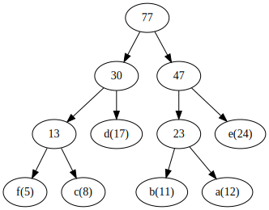
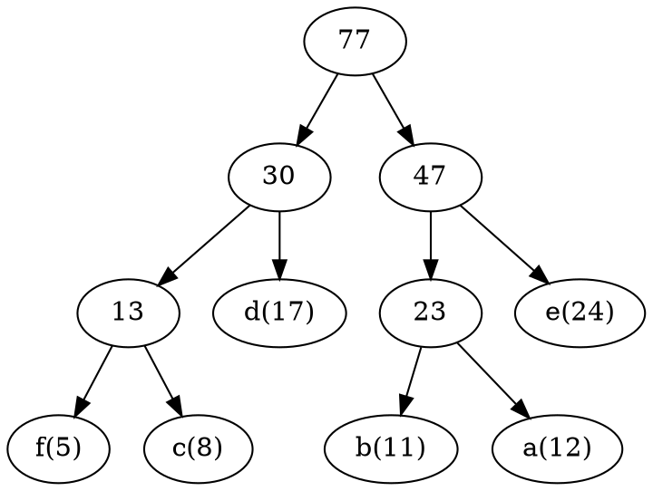
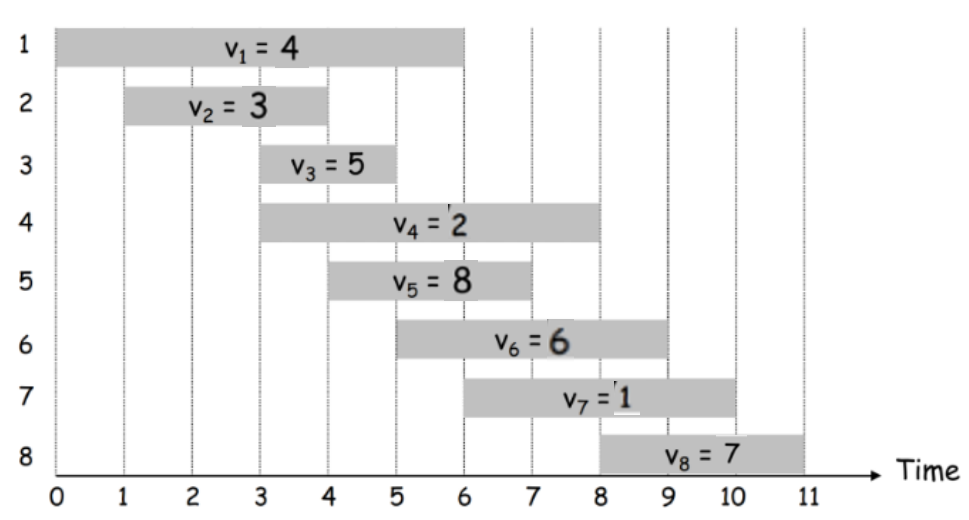

## 1. (2 pontos) Defina a abordagem greedy e comente uma das formas de garantir que os algoritmos greedy sempre encontram uma das soluções ótimas?

R: A abordagem greedy consiste em escolher a sempre a opção ótima local, indiferente de o que pode acontecer no futuro. Uma das formas de garantir que os algoritmos greedy sempre encontram uma das soluções ótimas é provar que a solução ótima global pode ser alcançada a partir de soluções ótimas locais. Ex: Vamos assumir um segundo algoritmo que, em um dado momento, escolhe uma opção que não é a ótima local; mesmo que esse 2º algoritmo escolha sempre a opção ótima local a partir desse momento, ele nunca vai conseguir alcançar o greedy, pois o greedy está sempre este passo à frente.

## 2. (2 pontos) Defina a abordagem de divisão e conquista e de um exemplo de algoritmo que utiliza essa abordagem.

R: A abordagem de divisão e conquista consiste em dividir um problema em subproblemas menores, resolvê-los e depois combinar as soluções para obter a solução do problema original. Um exemplo que podemos citar foi idealizado em 1969 por _um matemático_, que queria diminuir a complexidade até então estabelecida de multiplicação de matrizes $O(n^3)$. O algoritmo consiste em dividir as matrizes em quatro submatrizes menores, realizar 7 somas e multiplicações menores e, posteriormente, somar e unir as submatrizes. O resultado, apesar de ter algumas limitações, conseguiu alcançar uma complexiade de aproximadamente $O(n^{2.81})$ ou $O(n^{\log_2 7})$.

## 3. (2 pontos) Resolva as seguintes recorrências utilizando o método mestre: 
 
#### a. $T(n) = 4T(\frac{n}{16}) + 1$

#### b. $T(n) = 16T(\frac{n}{32}) + n^\frac{1}{3}$

#### c. $T(n) = 4T(\frac{n}{16}) + n$

#### d. $T(n) = 9T(\frac{n}{5}) + n^3$

## 4. (2 pontos) Com base no algoritmo de Huffman codes responda as questões abaixo:

#### a. O Huffman codes utiliza que abordagem algorítmica para compressão de dados?

R: Utiliza uma técnica de agrupar símbolos por frequência, o que permite que símbolos mais frequentes sejam representados por códigos menores.

#### b. Qual o tempo de execução do algoritmo? 

R: O(n log n).

#### c. Defina a árvore final para o seguinte dicionário (letra:frequência): `{[a:12], [b:11], [c:8], [d:17], [e:24], [f:5]}`.

%22%2C%22c(8)%22%0A%20%2023%20-%3E%20%22b(11)%22%2C%22a(12)%22%0A%20%2030%20-%3E%2013%2C%20%22d(17)%22%0A%20%2047%20-%3E%2023%2C%20%22e(24)%22%0A%20%2077%20-%3E%2030%2C%2047%0A%7D)

#### d. Descreva os códigos definidos pela árvore do item c.

| Letra | Código |
|-------|--------|
| a     | 101    |
| b     | 100    |
| c     | 001    |
| d     | 01     |
| e     | 11     |
| f     | 000    |

## 5. (2 pontos) Utilize a abordagem de programação dinâmica com memoização para resolver a alocação de tarefas ponderadas abaixo.

$$
OPT(j) = \begin{cases}
0, & \text{se } j = 0 \\
\max(v_j + OPT(p(j)), OPT(j - 1)), & \text{se } j > 0
\end{cases}
$$

Responda as seguintes perguntas:  

#### a. O que é memoização?

R: Memoização é uma técnica de programação dinâmica que consiste em armazenar os resultados de subproblemas para evitar recálculos. Ex: vamos assumir que $n^{100}$ é uma operação custosa, então, se eu já calculei $n^{100}$ para $n = 5$, não preciso recalcular nada, posso simplesmente armazenar o resultado e reutilizar da próxima vez que fizer uma chamada para $n = 5$.

#### b. Calcule $p(j)$ para todas as requisições.

#### c. Calcule $OPT(8)$.

| j | 1 | 2 | 3 | 4 | 5 | 6 | 7 | 8 |
|---|---|---|---|---|---|---|---|---|
| $v_j$ | 4 | 3 | 5 | 2 | 8 | 6 | 1 | 7 |
| $p_j$ | 0 | 0 | 0 | 0 | 2 | 3 | 1 | 4 |
| $OPT(p(j))$ | 0 | 0 | 0 | 0 | 4 | 5 | 4 | 5 |
| $OPT(j - 1)$ | 0 | 4 | 4 | 5 | 5 | 12 | 12 | 12 |
| $OPT(j)$ | 4 | 4 | 5 | 5 | 12 | 12 | 12 | 12 |

$OPT(0) = 0$

$OPT(1) = \max(4 + OPT(0), OPT(0)) = \max(4 + 0, 0) = \max(4, 0) = 4$

$OPT(2) = \max(3 + OPT(0), OPT(1)) = \max(3 + 0, 4) = \max(3, 4) = 4$

$OPT(3) = \max(5 + OPT(0), OPT(2)) = \max(5 + 0, 4) = \max(5, 4) = 5$

$OPT(4) = \max(2 + OPT(0), OPT(3)) = \max(2 + 0, 5) = \max(2, 5) = 5$

$OPT(5) = \max(8 + OPT(2), OPT(4)) = \max(8 + 4, 5) = \max(12, 5) = 12$

$OPT(6) = \max(6 + OPT(3), OPT(5)) = \max(6 + 5, 12) = \max(11, 12) = 12$

$OPT(7) = \max(1 + OPT(1), OPT(6)) = \max(1 + 4, 12) = \max(5, 12) = 12$

$OPT(8) = \max(7 + OPT(4), OPT(7)) = \max(7 + 5, 12) = \max(12, 12) = 12$

#### d. Indique quais requisições fazem parte da solução ótima dada por $OPT(8)$.

R: `{ 8, 5, 2 }`
